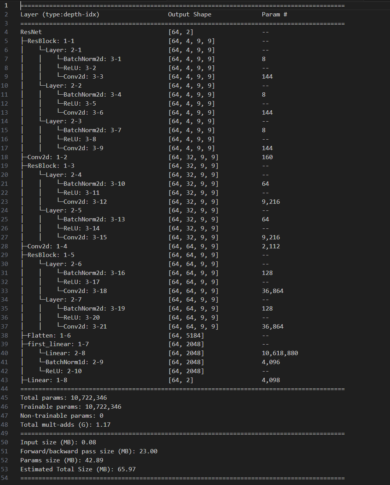

# DEAP Emotion Recognition with TorchEEG ResNet

A semi-professional walkthrough of a TorchEEG-powered emotion recognition pipeline built on the DEAP EEG dataset. The notebook `ResNet_on_deap_dataset_emotion_recognition (1).ipynb` combines TorchEEG’s preprocessing/data split helpers and a custom ResNet head to classify valence into two classes.



## Highlights

- **Dataset & preprocessing** – Uses `DEAPDataset` with cached preprocessed files, computing differential entropy over 4 sub-bands, debaselining, grid mapping, and valence labeling (binary threshold 5.0). Online transforms remove the baseline and convert the grid into tensors for PyTorch models.
- **Modeling flow** – Builds a custom ResNet (multiple residual blocks, 1×1 projection, flatten+MLP head) and compares it to TorchEEG’s ViT/CCNN candidates. Torchinfo summary (shown above) confirms the 10.7M parameter count.
- **Training** – Wraps the datasets in grouped train/val/test splits, feeds them into `DataLoader`s with pinned memory/persistent workers, and trains using `ClassifierTrainer` with an EarlyStopping callback monitoring validation F1.
- **Evaluation** – After fitting for up to 50 epochs, the trainer runs a test pass and reports precision/recall/f1/accuracy/kappa. The notebook stores the split metadata in `.torcheeg/model_selection_*` folders and the dataset cache under `.torcheeg/datasets_*`.

## Getting started

1. Clone this repo and `cd` into the notebook directory.
2. (in-case of wheel/pip error) Create and activate a Python (=3.10) venv.
3. Install dependencies:
   ```bash
   pip install -r requirements.txt
   # or
   pip install torcheeg ipywidgets torch-scatter torchinfo pytorch-lightning
Download the [DEAP raw files](https://www.kaggle.com/datasets/manh123df/deap-dataset) into deap-dataset/data_preprocessed_python or reuse the cached path referenced in the notebook.
Launch the notebook with jupyter lab/notebook and run cells in order.

Tips
If you switch to a different GPU/CPU, adjust the accelerator argument in ClassifierTrainer.
Use the .torcheeg/model_selection_* splits to reproduce the same train/val/test split across experiments.
For interpretability, capture validation metrics and loss curves by extending the trainer callbacks (e.g., LearningRateMonitor, ModelCheckpoint).
Assets
resnet_summary.png: Torchinfo summary (paste the provided screenshot here).
